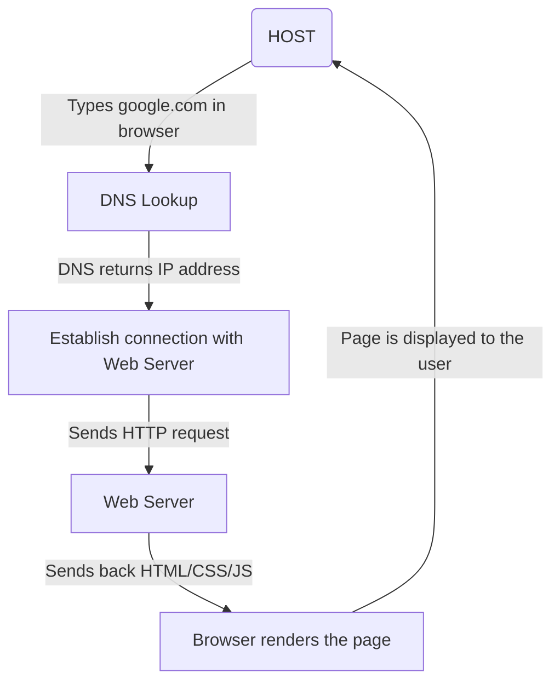

# File Server (Samba)

## What is a file server?

A file server is a computer responsible for the storage and management of [data](https://www.techtarget.com/searchdatamanagement/definition/data) files so that other computers on the same network can access the files. It enables users to share information over a network without having to physically transfer files.

[read more](https://www.techtarget.com/searchnetworking/definition/file-server#:~:text=A%20file%20server%20is%20a%20computer%20responsible,the%20same%20network%20can%20access%20the%20files.&text=The%20file%20server%20takes%20on%20the%20computer,store%20and%20share%20files%20for%20a%20network.)
___
## Samba

SMB/CIFS file, print, and login server for Unix

---
### 📚 [Documentation](https://wiki.samba.org/index.php/Main_Page)

---

How to install samba

```shell
apt install samba
```

---
## Creating a Share folder

It is not recommend to create a shared folder in your main disk (where your S.O is installed) as it may become slow when someone accesses your shared folder.

So I will use my new partition `sdb` to create the shared folder inside it.

### 1. `mkdir /mnt/disk2 public

This command will create a folder in the sdb device (disk).

### 2. `chmod 777 public`

This command will give full access to anyone (rwx).

---
### 3. `nano /etc/samba/smb.conf`

This is the main Samba configuration file (`smb.conf`) located in `/etc/samba/` using the `nano` text editor, allowing you to view or edit the file.

```shell
[public]
path = /mnt/disk2/public
writable = yes
guest ok = yes
guest only = yes
```

- **`[public]`**: This starts the definition of a new share called `public`. This is the name users will see on the network.
    
- **`path = /mnt/disk2/public`**: This is the directory on the server that will be shared.
    
- **`writable = yes`**: Allows users to write (upload, delete, modify) files in the shared folder.
    
- **`guest ok = yes`**: Allows guest (unauthenticated) users to access the share.
    
- **`guest only = yes`**: Ensures that **only** guest users can access the share, even if they have a username and password, they will still be treated as guests.
---
### 4. `systemctl restart smbd`

Since we have modified the `smb.conf` file, we now need to restart the service.

```shell
systemctl restart smbd
```

---
### 5. `systemctl enable smbd`

This command ensures that the Samba service will **start automatically** every time the system boots.

### 6. `smb://192.168.1.29/public` 

Connect to the `public` shared folder on the computer at IP `192.168.1.29` using Samba.

---
# Web Server (Apache)

## What is a Web Server?

A web server is a computer system or software that stores, processes, and delivers web pages to users over the internet. When a user types a website address into their browser or clicks a link, the browser sends a request to the web server, which then responds by sending back the requested web paga, usually in HTML format, along with any necessary files like images, stylesheets, or scripts. Web servers can host multiple websites and are essential for making content available online. Popular web server software includes Apache, Nginx, and Microsoft's IIS.

---
## What happens when you try to access a website

1. **Typing the URL**: The user types a website address (e.g., `google.com`) into their browser.
    
2. **DNS Resolution**: The browser asks the DNS (Domain Name System) to translate the domain name into an IP address.
    
3. **Establishing Connection**: Once the IP is returned, the browser opens a connection to the web server at that IP, usually using a protocol like **HTTP** or **HTTPS**.
    
4. **Sending HTTP Request**: The browser sends an HTTP request to the web server, asking for a specific resource like a webpage, image, or script (e.g., “GET /index.html”).
    
5. **Server Response**: The web server receives the request, processes it, and sends back an HTTP response that includes the content (like HTML) and a status code (e.g., 200 OK).
    
6. **Rendering the Page**: The browser receives the response, interprets the HTML, and may make additional requests for styles, images, or scripts. It then renders the complete webpage for the user to see.


---
## Apache2

### 1. `apt install apache2`

This command will install the Apache2 in your pc

```shell
root@server-santander-linux:~# apt install apache2 -y
```


### 2. `systemctl status apache2` 

Show runtime status of the apache2

```shell
root@server-santander-linux:~# systemctl status apache2
● apache2.service - The Apache HTTP Server
     Loaded: loaded (/usr/lib/systemd/system/apache2.service; enabled; preset: enabled)
     Active: active (running) since Thu 2025-04-24 18:00:31 UTC; 6min ago
...
```

### 3. Apache2 Default Page

Now we can access the Apache2 Default Page using the VM IP.

1. Open your browser
2. type the VM IP and press enter

### 4. `cd /var/www/html/`

The index.html you see when you typed your IP in the browser is here.

I modified it using nano to display it:

```html
<html>
	<h1>Hello World!</h1>
	<h2>This is my HTML site available in a linux server</h2>
	<script>
		console.log("You found me");
	</script>
</html>
```

The "script" part can only be seen in your browser's developer tools. The default shortcut to open it is to press F12.

# Database Server (MySQL)

## What is a Database Server?

A database server is a specialized server dedicated to managing and providing access to databases. It serves as a centralized repository for storing structured data and enables multiple clients or applications to interact with the database simultaneously. Database servers run database management system (DBMS) software, facilitating tasks such as data storage, retrieval, manipulation, and security. They ensure data integrity, concurrent access, and scalability while optimizing performance through indexing, query optimization, and caching. Common examples of DBMS software include MySQL, Oracle Database, and Microsoft SQL Server. Overall, database servers play a critical role in organizing, securing, and facilitating access to data within an organization or network.

[read more](https://www.lenovo.com/us/en/glossary/database-server/?orgRef=https%253A%252F%252Fwww.google.com%252F)

---
## MySQL

### 1. `apt install mysql-server-8.0`

This command will install MySQL Server on your server/desktop.

```shell
root@server-santander-linux:/var/www/html# apt install mysql-server-8.0
Reading package lists... Done
Building dependency tree... Done
Reading state information... Done
...
```

### 2. `mysql -u root -p`

The command is used to log into the MySQL command-line client.

Here’s a breakdown of what each part means:

- `mysql`: This is the command to start the MySQL client program.
    
- `-u root`: This tells MySQL to log in using the **user `root`**, which is typically the administrative user.
    
- `-p`: This means **"prompt for password"**. After running the command, MySQL will ask you to enter the password for the `root` user.

### MySQL commands

1. `show databeses;`: It displays all your databases
2. `create database database_name;`: it will create a new database with the provided name (e.g., `create database my_bank;`).
3. `use database_name;`: change the current database (e.g., `use my_bank`).
4. `create table table_name`: It creates a table in your database and you can define its columns inside parentheses ():

	```mysql
	create table People (personID int, Name varchar(50), Surname varchar(50),
	Address varchar(100), city varchar(50));
	```

5. `show tables;`: It displays all the tables in your database
   
	```shell
	mysql> show tables;
	+-------------------+
	| Tables_in_my_bank |
	+-------------------+
	| People            |
	+-------------------+
	1 row in set (0.00 sec)
	```

6. `insert into ... values ...`: You can use this command to insert values in your tables (populate the database)
   
   Exemple:
   
	```mysql
	insert into People (personID, Name, Surname, Address, city)
	VALUES (1, 'Joel', 'Travassos', '123 Main Street.', 'Olinda-PE');
	```

7. `select * from People;`: It displays all the values in the People table.
   
	```shell
	mysql> select * from People;
	+----------+------+-----------+------------------+-----------+
	| personID | Name | Surname   | Address          | city      |
	+----------+------+-----------+------------------+-----------+
	|        1 | Joel | Travassos | 123 Main Street. | Olinda-PE |
	+----------+------+-----------+------------------+-----------+
	1 row in set (0.00 sec)
	```